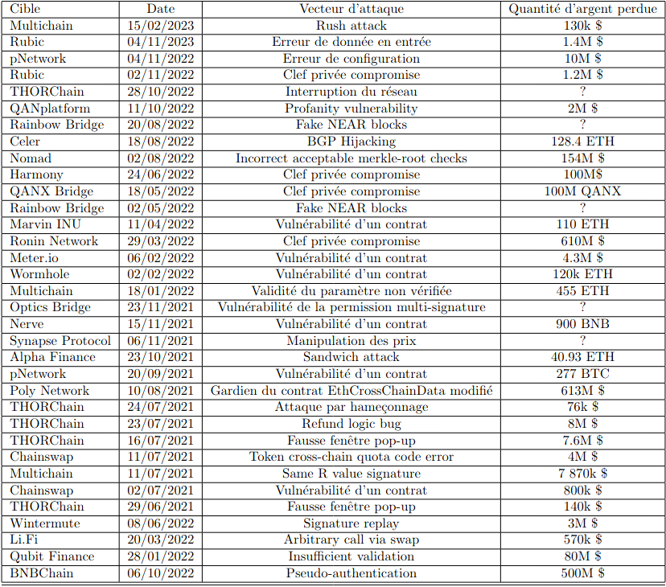

# Notes Louis

## Enumération des attaques sur les bridges



## Résumé Nomad (article 3)

Nomad est un protocole permettant d'établir des bridges entre Ethereum et d'autres blockchains.

2 types de contrats dans Nomad : 
* [Home](https://docs.nomad.xyz/the-nomad-protocol/smart-contracts/home)
* [Replica](https://docs.nomad.xyz/the-nomad-protocol/smart-contracts/replica)

Un contrat 'Home' est le contrat principal où la dApp (decentralized application) est déployée et stockée. 
Chaque blockchain déploie un contrat 'Replica' qui valide et stocke des messages dans une structure de donnée de type ["Merkle tree"](https://academy.binance.com/en/glossary/merkle-tree)

Nomad a déployé un contrat permettant de gérer la réclamation des utilisateurs sur leurs actifs ("bridged assets"). Dans ce contrat, des paramètres d'initialisation ont été indiqués.

```
function initialize(
    // ...
    bytes32 _committedRoot,
    // ...
) public initializer {
    // ...
    confirmAt[_committedRoot] = 1;//warning!
    // ...
}
```

Lors d'un déploiement initial, le 'Merkle tree' est vide, avec une valeur égale à 0x0 * 32 et confirmAt[bytes32(0)] est égal à 1.

Puis il y a eu un changement dans l'implémentation de la fonction process()

```
function process(bytes memory _message) public returns (bool _success) {
    // ...
    require(acceptableRoot(messages[_messageHash]), "!proven");
    // ...
}
```

Il y a ajout d'un appel de la fonction acceptableRoot() qui fait elle-même appel au mapping "confirmAt[_committedRoot]".

```
uint256 _time = confirmAt[_root];
if (_time == 0) {
    return false;
}
return block.timestamp >= _time;
```

Pour tout nouveau message, root = bytes32(0) => confirmAt[bytes32(0)] = 1

acceptableRoot(bytes32(0)) retourne 'True' et permet à des messages d'être traités sans avoir été prouvés au préalable.

## Résumé Wormhole (article 5)

Wormhole, le bridge de Solana, a été manipulé pour créditer 120k ETH comme ayant été déposés sur Ethereum, ce qui a permis au pirate de frapper ("mint") l'équivalent en wETH (Wormhole ETH) sur Solana.

1) En utilisant un SignatureSet créé lors d'une transaction précédente, le pirate a d'abord pu contourner les gardiens de Wormhole mis en place pour vérifier les transferts entre les chaînes et appeler "verify_signatures" sur le bridge principal.

2) La fonction "verify_signatures" du contrat délègue ensuite la vérification du "SignatureSet" à un programme Secp256k1 distinct. En raison d'une divergence entre 'solana_program::sysvar::instructions' (une sorte de précompilation) et le 'solana\_program' utilisé par Wormhole, le contrat n'a pas vérifié correctement l'adresse fournie, et l'attaquant a pu fournir une adresse contenant seulement 0,1 ETH.

3) En utilisant un compte créé quelques heures plus tôt avec une seule instruction sérialisée correspondant au contrat Sep256k1, l'attaquant a pu falsifier le "SignatureSet", appeler "complete\_wrapped" et frapper frauduleusement 120k ETH sur Solana en utilisant la vérification VAA qui avait été créée dans une transaction précédente.

## Wormhole

### Nutshell

Protocole générique de passage de messages ("generic message passing protocol") qui connecte plusieurs chaînes (Ethereum, Solana, Binance Smart Chain, Polygon, Avalanche, Algorand, Fantom, Karura, Celo, Acala, Aptos and Arbitrum).

Wormhole émet des messages à partir d'une chaîne qui sont observés par un réseau de nœuds "Guardian" puis vérifiés. Après vérification, ce message est soumis à la chaîne cible pour traitement.

### VAA (verified action approval)

Primitive de messagerie de base de Wormhole, content une en-tête et un corps ("body").

```
(header)
byte        version                  (VAA Version)
u32         guardian_set_index       (Indicates which guardian set is signing)
u8          len_signatures           (Number of signatures stored)
[][66]byte  signatures               (Collection of ecdsa signatures)

```

```
(body)
u32         timestamp                 (Timestamp of the block where the source transaction occurred)
u32         nonce                     (A grouping number)
u16         emitter_chain             (Wormhole ChainId of emitter contract)
[32]byte    emitter_address           (Emitter contract address, in Wormhole format)
u64         sequence                  (Strictly increasing sequence, tied to emitter address & chain)
u8          consistency_level         (What finality level was reached before emitting this message)
[]byte      payload                   (VAA message content)
```

### Portal payloads

Charges utiles spécifiques attachés à un VAA depuis une chaîne source pour indiquer à la chaîne cible comment traiter le message Wormhole après vérification.

5 charges utiles au total :

* Transfer (déclenche la libération de jetons verrouillés)
* TransferWithPayload (pareil que ci-dessus avec un payload supplémentaire spécifique au domaine)
* AssetMeta (atteste les metadatas de l'actif)
* RegisterChain (enregistre le contrat bridge pour une chaîne étrangère)
* UpgradeContract

#### Transfer

Les jetons sont transférés d'une chaîne à l'autre à l'aide d'un mécanisme de verrouillage/monnayage ("lockup/mint") et de brûlage/déverrouillage ("burn/unlock").

Pour transférer des jetons de A à B, nous devons verrouiller les jetons sur A et les frapper sur B. Il est important de prouver que les jetons sur A sont verrouillés avant que la frappe puisse avoir lieu sur B. Pour faciliter ce processus, la chaîne A verrouille d'abord les jetons et émet un message indiquant que le verrouillage a été effectué.

"Chain B is agnostic as to how the token on the sending side were locked".

Le protocole se contente de relayer l'événement une fois qu'un nombre suffisant de gardiens en ont attesté l'existence.

```
u8      payload_id = 1          Transfer
u256    amount                  Amount of tokens being transferred.
u8[32]  token_address           Address on the origin chain.
u16     token_chain             Numeric ID for the origin chain.
u8[32]  to                      Address on the destination chain.
u16     to_chain                Numeric ID for the destination chain.
u256    fee                     Portion of amount paid to a relayer.
```

#### Asset

La chaîne A émet un message contenant des métadonnées sur une adresse, que la chaîne B peut stocker afin de connaître le nom, le symbole et la précision décimale de l'adresse d'un jeton.

Obligatoire avant de pouvoir effectuer un transfert !!

```
u8         payload_id = 2
[32]byte   token_address
u16        token_chain
u8         decimals
[32]byte   symbol
[32]byte   name
```

### Relayer

"Un processus qui délivre un ou plusieurs VAA(s) à une destination"

* Trustless
* Sans privilèges

1) Effectuer une action sur la chaîne A
2) Récupérer le VAA résultant du "Guardian Network"
3) Effectuer une action sur la chaîne B en utilisant le VAA


## ERC 5164

Exécution cross-chain (14/06/2022)

Création d'une interface d'éxécution crosschain pour les blockchain basées sur EVM.

Permet à un contrat hébergé sur une chaîne 1 d'appeler des contrats sur une chaîne 2 en envoyant un message cross-chain.

2 composants :
* Message Dispatcher : chaîne d'origine / diffuse message via une couche de transport à un ou plusieurs contrats de type "MessageExecutor"
* Message Executor : chaîne de destination / exécute les messages "dispatchés"

```
struct Message {
  address to;
  bytes data;
}

interface MessageDispatcher {
  event MessageBatchDispatched(
    bytes32 indexed messageId,
    address indexed from,
    uint256 indexed toChainId,
    Message[] messages
  );
}
```

Sources :
  * [DeFi Hacks Analysis - Root Cause](https://web3sec.notion.site/web3sec/ba459372dc434341b99ec92a932f98dc?v=7fceca7b3da74aa8a99b49c44a2a3916)
  * [Slowmist Hacked - Summary of blockchain attack events](https://hacked.slowmist.io/?c=Bridge)
  * [Article 4 PFE](https://medium.com/coinmonks/cross-chain-bridge-vulnerability-summary-f16b7747f364)
  * [Coinbase -  Nomad bridge incident analysis](https://www.coinbase.com/blog/nomad-bridge-incident-analysis)
  * [Rekt - Le layer 2](https://rekt.news/fr/the-second-layer/)
  * [Rekt - Wormhole](https://rekt.news/fr/wormhole-rekt/)
  * [Ethereum - Bridges](https://ethereum.org/fr/developers/docs/bridges/)

  * [Wormhole 'whitepaper'](https://github.com/wormhole-foundation/wormhole/blob/main/whitepapers/0003_token_bridge.md)
  * [Wormhole docs 1](https://docs.wormhole.com/wormhole/)
  * [Wormhole docs 2](https://book.wormhole.com/)
  * [Wormhole token bridge relayer example](https://github.com/wormhole-foundation/example-token-bridge-relayer)

  * [ERC 5164, 6170](https://eips.ethereum.org/erc)
  * [ERC 5164 Thread](https://ethereum-magicians.org/t/eip-5164-cross-chain-execution/9658/13)
  * [ERC 5164 Implementation](https://github.com/pooltogether/ERC5164)

